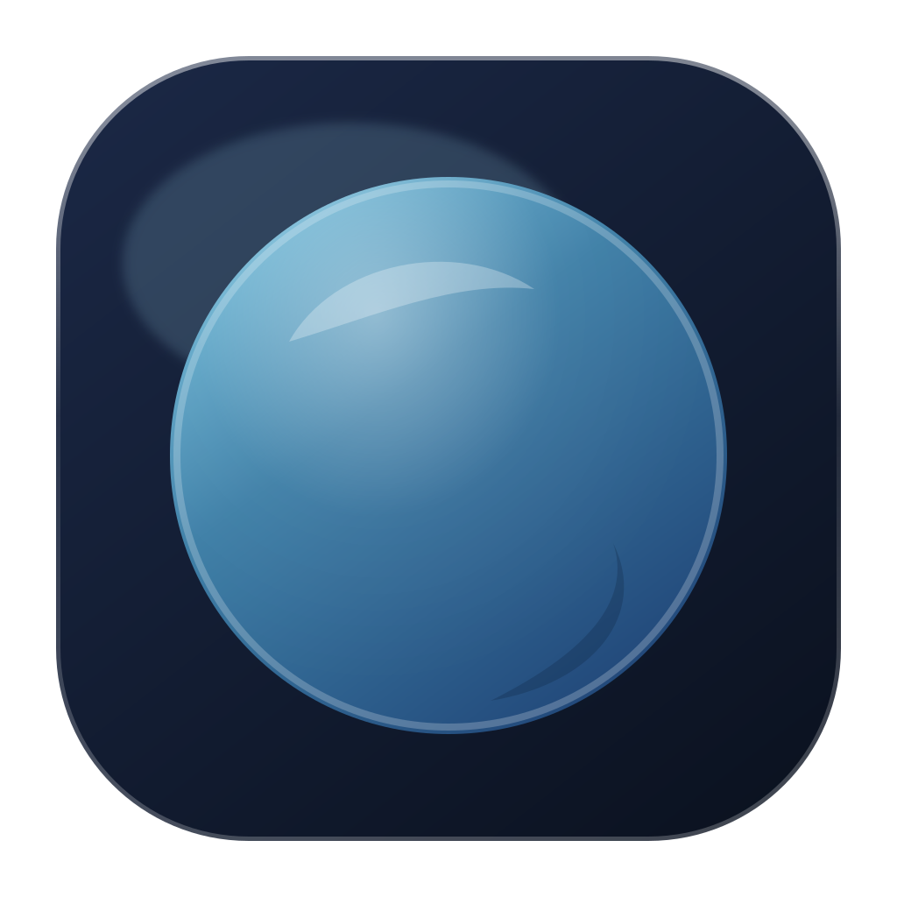
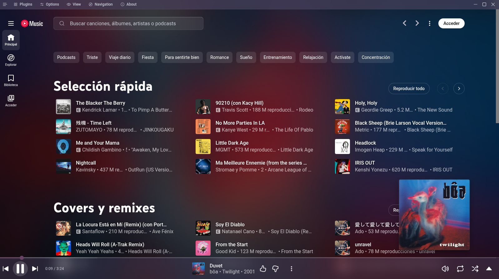

# Ruri

<p align="center">
  
</p>

<p align="center">
  A refined desktop client for music, with frosted-glass chrome and a plugin gallery.<br>
  Fork of <a href="https://github.com/pear-devs/pear-desktop">Pear Desktop</a> (MIT) — <strong>not</strong> YouTube, Google, Pear Desktop, or <a href="https://github.com/NanKillBro/glassy-music-nankill">Glassy Music</a>.
</p>

<p align="center">
  
</p>

| | |
| --- | --- |
| Product | Ruri **0.1.0** |
| License | [MIT](license) — see [NOTICE](NOTICE) |
| App id | `dev.ruri.desktop` |
| Protocol | `ruri:` |
| Min window | 1100×620 (disable under Options → Advanced) |
| Forked from | pear-devs/pear-desktop 3.12.0 |

## Install

Unsigned builds. GitHub Actions packages Linux, Windows, and macOS when you push a `v*` tag:

```bash
git tag v0.1.0
git push origin v0.1.0
```

That runs [Release](.github/workflows/release.yml) and attaches files to the GitHub Release. You can also run the workflow by hand from the Actions tab (artifacts only, no Release).

| Platform | Artifact |
| --- | --- |
| Linux x64 | `Ruri-*.AppImage`, `ruri-*.tar.gz`, `ruri_*_amd64.deb` |
| Windows x64 | `Ruri *.exe` (portable) and `Ruri Setup *.exe` (NSIS) |
| macOS | `Ruri-*-mac.zip` / `.dmg` (x64 and arm64) |

```bash
chmod +x Ruri-0.1.0.AppImage
./Ruri-0.1.0.AppImage
```

Local packaging still works: `pnpm build` then `pnpm exec electron-builder --linux AppImage:x64 tar.gz:x64 -p never`. Output: `pack/`.

This repository stays MIT. Do not vendor GPL-3.0 code (Better Lyrics, Glassy Music Merge Theme, or related extensions).

## Look

Glass chrome is on by default: frosted navigation, search, menus, and player bar, plus a blurred album-art backdrop. Toggle plugins from the in-app menu (Windows/Linux). macOS keeps native traffic lights.

<p align="center">
  
</p>

<p align="center">
  
</p>

<p align="center">
  
  
</p>

Short clips (same captures): [home.mp4](web/home.mp4) · [plugins.mp4](web/plugins.mp4)

Default-on: **Glassy Theme**, **Glassy Backdrop**, **Album Color Theme**, **Synced Lyrics**, **Do Not Track**. Do not enable Glassy Theme together with Blur Navigation Bar (double blur). Turn off Transparent Player while the backdrop is on.

## Deep links

The packaged app registers `ruri://`. Commands are playback controls:

```
ruri://play
ruri://pause
ruri://playPause
ruri://next
ruri://previous
ruri://like
ruri://seekTo%2030
```

Arguments are separated by an encoded space (`%20`).
Linux example: `xdg-open 'ruri://playPause'`. Do not use Pear’s `youtubemusic:` scheme.

## Dev

Node `>=22`, pnpm `>=11`.

```bash
pnpm install --frozen-lockfile
pnpm dev
```

```bash
pnpm check          # lint + format + types
pnpm test           # Playwright (unit + Electron smoke)
pnpm build          # dist/ for packaging
pnpm exec electron-builder --linux AppImage:x64 tar.gz:x64 -p never
```

`origin` is `rjahir-rv/ruri`. Do **not** push to `pear-devs/pear-desktop`.

```bash
git remote add upstream https://github.com/pear-devs/pear-desktop.git
git fetch upstream
git merge upstream/master
```

Keep Ruri identity files (`package.json`, `electron-builder.yml`, `license`, `NOTICE`, `README.md`, icons, `src/i18n/index.ts`, `src/index.ts` app id).

## Credits

- [Pear Desktop](https://github.com/pear-devs/pear-desktop) (MIT) — host and plugins
- Glass look is original work. [Glassy Music](https://github.com/NanKillBro/glassy-music-nankill) is a visual reference only (GPL-3.0, not copied)

## License

MIT. Ruri additions: [rjahir-rv](https://github.com/rjahir-rv). Pear Desktop: th-ch / pear-devs. See [`license`](license) and [`NOTICE`](NOTICE).

> [!IMPORTANT]
> **No affiliation.** This project is not affiliated with, authorized by, endorsed by, or connected with Google LLC, YouTube, or their affiliates. Independent unofficial desktop shell.
>
> **Trademarks.** “Google”, “YouTube Music”, and related marks belong to their owners. Use here is identification only.
>
> **AS IS.** You use this software at your own risk.
