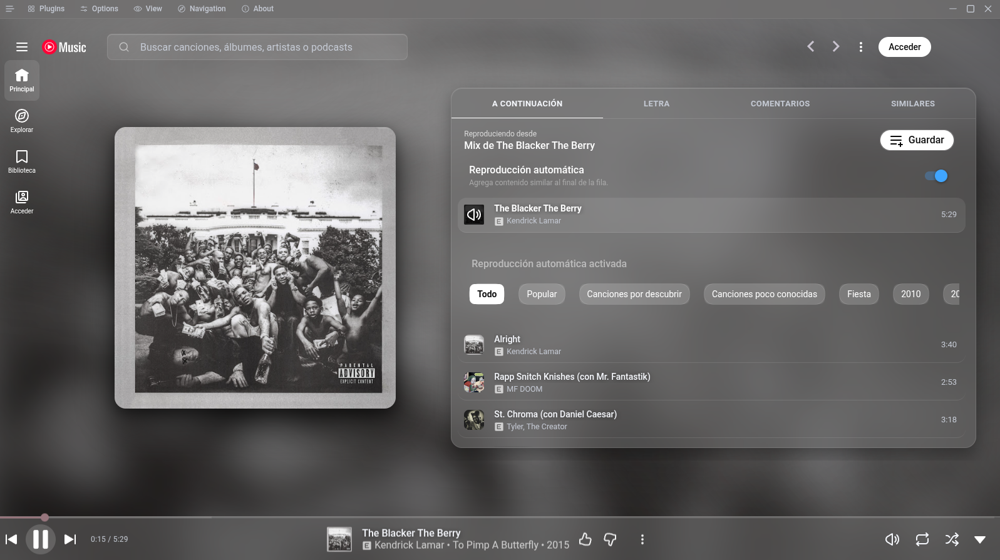

<h1>
  
  Ruri
</h1>

[English](README.md) · [Español](README.es.md) · **Português**

Um desktop para música com cromado de vidro fosco e uma galeria de plugins. Cliente independente de código aberto para o YouTube Music, baseado no [Pear Desktop](https://github.com/pear-devs/pear-desktop) (MIT).

<p align="center">
  
</p>

| | |
| --- | --- |
| Produto | Ruri **0.2.0** <!-- x-release-please-version --> |
| Licença | [MIT](license) — ver [NOTICE](NOTICE) |
| Id do app | `dev.ruri.desktop` |
| Protocolo | `ruri:` |
| Janela | 1600×900 por padrão, mínimo 1100×620 (dá para desativar em Opções → Avançado) |
| Fork de | pear-devs/pear-desktop 3.12.0 |

## O que é

O Ruri é uma camada nativa em volta do player: cromado fosco, um fundo que segue o álbum e plugins que você liga sem sair da janela. A capa define a cor e o desfoque; o cromado não atrapalha.

- **Cromado de vidro** — navegação, busca, menus e barra do player translúcidos
- **Fundo desfocado** — cor e blur ao vivo a partir do álbum que está tocando
- **Letras** — linhas sincronizadas na tela de reprodução, inclusive em tela cheia
- **Adblock** — bloqueio de rastreadores ligado por padrão (Do Not Track)
- **Galeria de plugins** — visualizadores, dispositivo de saída e mais, no menu do app
- **Protocolo `ruri://`** — play, pause, pular e seek por atalhos, scripts ou um Stream Deck

## Visual

O vidro já vem ligado. Windows e Linux usam a barra de título do app; o macOS mantém os semáforos nativos.

Mais capturas: [reprodução](web/player1.png) · [fila](web/player2.png) · [letras em tela cheia](web/fullscreen+lyrics.png) · [galeria de plugins](web/plugins_menu.png)

Ligados por padrão: **Glassy Theme**, **Glassy Backdrop**, **Album Color Theme**, **Synced Lyrics**, **Do Not Track** (adblock).

> [!NOTE]
> Não ligue Glassy Theme junto com Blur Navigation Bar (blur duplicado). Desligue Transparent Player se o Glassy Backdrop estiver ativo.

## Baixar

**Você não precisa de uma conta no GitHub.** Abra a versão mais recente e clique no arquivo do seu computador — o download começa na hora:

**[Baixar Ruri](https://github.com/rjahir-rv/ruri/releases/latest)**

| Seu computador | Clique neste arquivo |
| --- | --- |
| Windows 10/11 (64 bits) | `Ruri Setup *.exe` (instalador). `Ruri *.exe` é portátil (não instala). |
| Mac com chip Apple (M1–M4) | `Ruri-*-arm64.dmg` |
| Mac com Intel | `Ruri-*.dmg` (o que **não** tem `arm64`) |
| Linux (Ubuntu/Debian) | `ruri_*_amd64.deb` ou `Ruri-*.AppImage` |
| Outro Linux | `Ruri-*.AppImage` ou `ruri-*.tar.gz` |

Não baixe os `.blockmap`. Eles são do atualizador, não do instalador.

Os builds não são assinados. O SmartScreen do Windows e o Gatekeeper do macOS vão avisar; isso é esperado (veja abaixo).

## Instalar

### Windows

1. Baixe `Ruri Setup *.exe`.
2. Se o navegador disser que o arquivo não é baixado com frequência, escolha **Manter** e depois **Manter mesmo assim**.
3. Quando o SmartScreen mostrar “O Windows protegeu o seu PC”, clique em **Mais informações** e depois em **Executar mesmo assim** (às vezes **Instalar mesmo assim**).
4. Conclua o instalador. No build portátil, basta executar `Ruri *.exe`.

Esses avisos aparecem porque o build do Windows não tem certificado Authenticode. Escolha **Executar mesmo assim** / **Instalar mesmo assim** — é o mesmo arquivo do Ruri que você acabou de baixar.

### macOS

1. Baixe o `.dmg` do seu chip (`arm64` = Apple silicon; sem `arm64` = Intel).
2. Abra a imagem de disco e arraste o **Ruri** para **Aplicativos**.
3. Na primeira abertura, o macOS pode dizer que o app está **danificado** ou que não pode ser aberto. O Gatekeeper faz isso com apps não assinados. Depois de copiá-lo para Aplicativos, no Terminal:

```bash
xattr -cr /Applications/Ruri.app
```

4. Abra o Ruri de novo. Se ainda estiver bloqueado: **Ajustes do Sistema → Privacidade e segurança → Abrir mesmo assim**.

Não desative o Gatekeeper no Mac inteiro.

### Linux

```bash
chmod +x Ruri-*.AppImage
./Ruri-*.AppImage
```

Debian/Ubuntu: instale `ruri_*_amd64.deb` com o gerenciador de pacotes.

## Protocolo

O app empacotado registra `ruri://`:

```
ruri://play
ruri://pause
ruri://playPause
ruri://next
ruri://previous
ruri://like
ruri://seekTo%2030
```

Os argumentos são separados por um espaço codificado (`%20`).

Linux: `xdg-open 'ruri://playPause'`. Não use o esquema `youtubemusic:` do Pear.

## Desenvolvimento

Node `>=22`, pnpm `>=11`.

```bash
pnpm install --frozen-lockfile
pnpm dev
```

```bash
pnpm check          # lint + formato + tipos
pnpm test:unit      # testes unitários do Playwright (CI)
pnpm test:electron  # smoke do Electron (Linux; xvfb-run se não houver tela)
pnpm test           # unit + electron
pnpm build          # dist/ para empacotar
pnpm exec electron-builder --linux AppImage:x64 tar.gz:x64 -p never
```

Saída local: `pack/`.

Releases: um merge em `master` abre um PR do release-please (`chore: release X.Y.Z`) com **Features** e **Bug Fixes** a partir de conventional commits. Ao mesclar esse PR, o tag é criado e a versão é publicada. O GitHub Actions anexa os arquivos de Linux, Windows e macOS.

Fallback manual:

```bash
git tag v0.2.0
git push origin v0.2.0
```

`origin` é `rjahir-rv/ruri`. **Não** envie push para `pear-devs/pear-desktop`.

```bash
git remote add upstream https://github.com/pear-devs/pear-desktop.git
git fetch upstream
git merge upstream/master
```

Mantenha os arquivos de identidade do Ruri (`package.json`, `electron-builder.yml`, `license`, `NOTICE`, `README.md`, `README.es.md`, `README.pt.md`, ícones, `src/i18n/index.ts`, id do app em `src/index.ts`).

O repositório permanece MIT. Não inclua código GPL-3.0 (Better Lyrics, Merge Theme do Glassy Music ou extensões relacionadas).

## Créditos

- [Pear Desktop](https://github.com/pear-devs/pear-desktop) (MIT) — host e plugins
- O visual de vidro é original. [Glassy Music](https://github.com/NanKillBro/glassy-music-nankill) é só referência visual (GPL-3.0, não copiado)

## Licença

MIT. Adições do Ruri: [rjahir-rv](https://github.com/rjahir-rv). Pear Desktop: th-ch / pear-devs. Ver [`license`](license) e [`NOTICE`](NOTICE).

> [!IMPORTANT]
> **Sem afiliação.** Este projeto não é afiliado, autorizado, endossado nem conectado ao Google LLC, YouTube ou seus afiliados. Camada de desktop independente e não oficial.
>
> **Marcas.** “Google”, “YouTube”, “YouTube Music” e marcas relacionadas pertencem aos seus donos. O uso aqui é só para identificar o serviço.
>
> **NO ESTADO EM QUE SE ENCONTRA.** O software é oferecido sem garantia de qualquer tipo, expressa ou implícita. Você o usa por sua conta e risco.
